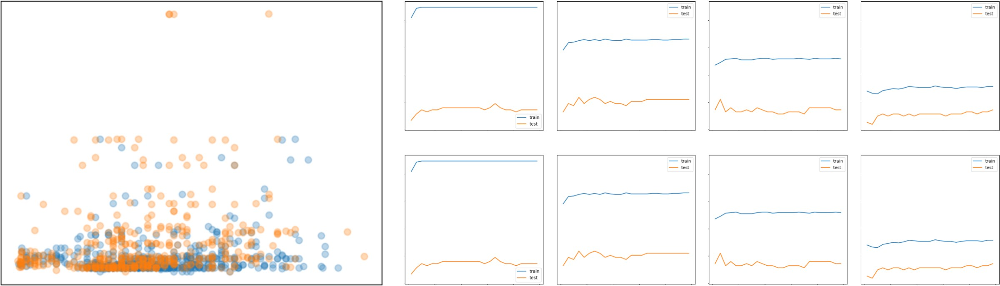
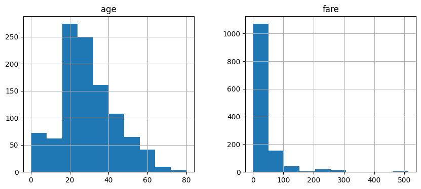
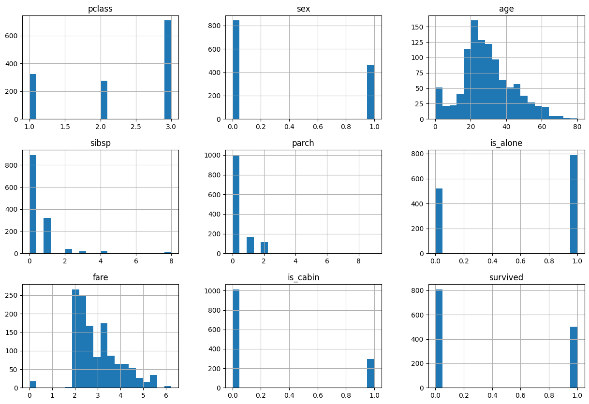
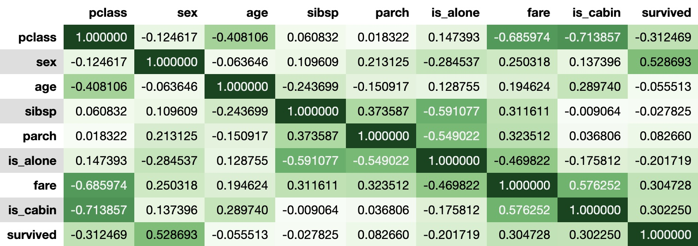
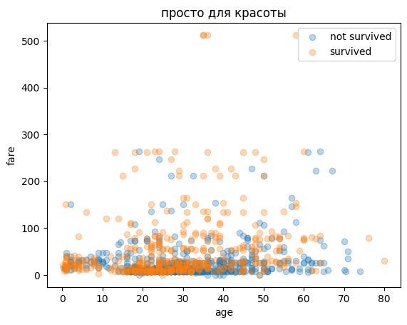
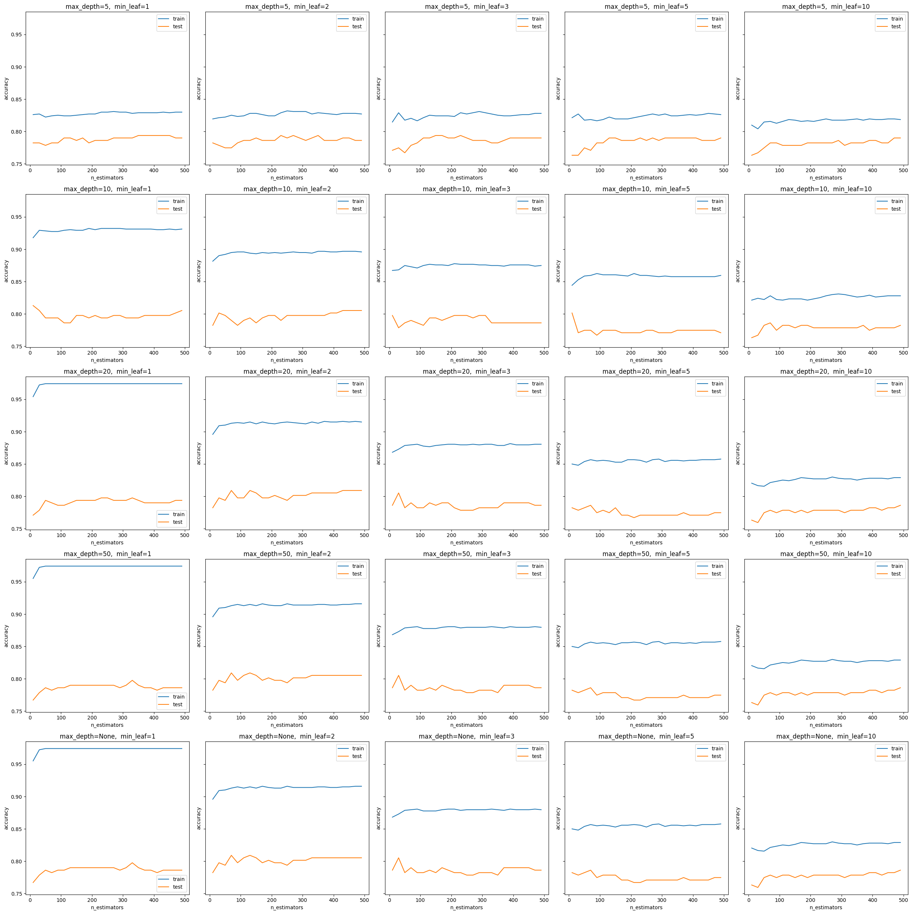
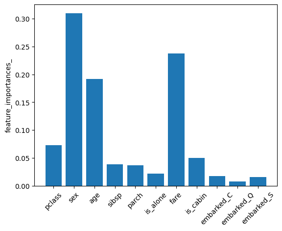

# Titanic — RandomForest Classifier

Бинарная классификация выживших на популярном датасете выживших на Титанике. Датасет OpenML version 1 (1309 пассажиров, 14 признаков).

**Accuracy на test: 0.8092** (split 80/20, `random_state=42`)


## Стек

- Python 3, pandas, numpy, scikit-learn 1.6.1
- `RandomForestClassifier` + `Pipeline` + `ColumnTransformer`


## Структура решения

```
загрузка → препроцессинг до split → train_test_split → Pipeline (imputer + OHE) → RF → accuracy
```


## Препроцессинг

- **pclass** — класс каюты пассажира (1, 2, 3)
- **survived** — выжил ли пассажир (0 — нет, 1 — да)   (target)
- **name** — имя пассажира
- **sex** — пол (male/female)
- **age** — возраст
- **sibsp** — количество братьев/сестёр и супругов на борту
- **parch** — количество родителей и детей на борту
- **ticket** — номер билета
- **fare** — стоимость билета
- **cabin** — номер каюты
- **embarked** — порт посадки (C — Шербур, Q — Квинстаун, S — Саутгемптон)
- **boat** — номер спасательной шлюпки (если выжил)
- **body** — номер тела (если не выжил и тело было найдено)
- **home.dest** — место проживания / пункт назначения

### Удалённые признаки

| Признак | Причина                                                          |
|---|------------------------------------------------------------------|
| `boat` | data leakage — наличие значения означает что пассажир выжил      |
| `body` | data leakage — наличие значения означает что пассажир не выжил   |
| `name`, `ticket`, `home.dest` | не несут предсказательной силы                                   |
| `cabin` | 77% пропусков                                                    |

### Новые признаки

```python
# факт наличия кабины (cabin удалён, но бинарный признак сохранён)
df['is_cabin'] = df['cabin'].notna().astype(int)

# одиночный пассажир без семьи на борту
df['is_alone'] = ((df['sibsp'] + df['parch']) == 0).astype(int)
```

`is_alone` показал более высокую корреляцию с таргетом чем сами `sibsp` и `parch` по отдельности.

### Логарифмирование `fare`



`fare` распределён в какой-то степени экспоненциально — логарифмирование "растягивает" плотную область около нуля, что улучшает качество разбиений в деревьях:

```python
df['fare'] = np.log(df['fare'] + 1)  # +1 т.к. есть нулевые значения
```



### Матрица корреляций



Наиболее сильные корреляции с `survived`:
- `sex` (0.53) — женщины выживали значительно чаще
- `pclass` (-0.31) — чем выше класс тем больше шансов
- `is_alone` (-0.20) — одиночки выживали реже

`fare` вопреки ожиданиям оказался более важным признаком чем `pclass` по данным feature importance.

### Scatter: age vs fare (по классу выживаемости)




## Pipeline

Препроцессинг намеренно вынесен в `Pipeline` чтобы исключить data leakage — `SimpleImputer` и `OneHotEncoder` обучаются на `X_train` и применяются независимо к `X_train` и `X_test`:

```python
num_pipeline = Pipeline([
    ('imputer', SimpleImputer(strategy='median'))
])

cat_pipeline = Pipeline([
    ('imputer', SimpleImputer(strategy='most_frequent')),
    ('encoder', OneHotEncoder(handle_unknown='ignore'))
])

preprocessor = ColumnTransformer([
    ('num', num_pipeline, num_cols),
    ('cat', cat_pipeline, cat_cols)
])
```

`StandardScaler` не применяется — деревья нечувствительны к масштабу признаков.


## Подбор гиперпараметров

Перебор по сетке `max_depth × min_samples_leaf × n_estimators` с построением кривых обучения для каждой пары:

```python
max_depths = [5, 10, 20, 50, None]
min_samples_leafs = [1, 2, 3, 5, 10]
n_estimators_range = range(10, 500, 20)
```


Итоговые гиперпараметры (`n_estimators >= 100` для устойчивости):

```python
RandomForestClassifier(
    n_estimators=130,
    max_depth=20,
    min_samples_leaf=2,
    class_weight='balanced',
    random_state=42
)
```


## Feature Importance



`fare` неожиданно оказался очень информативным признаком — сильнее чем `pclass`. Возможная интерпретация: внутри одного класса цена билета несла дополнительную информацию о социальном статусе и возможностях пассажира.


## Результат

```python
rf_pipe = Pipeline([
    ('preprocessor', preprocessor),
    ('model', RandomForestClassifier(
        n_estimators=130,
        max_depth=20,
        min_samples_leaf=2,
        class_weight='balanced',
        random_state=42
    ))
])

rf_pipe.fit(X_train, y_train)
accuracy_score(y_test, rf_pipe.predict(X_test))
```

```
Accuracy on test: 0.8092
```
